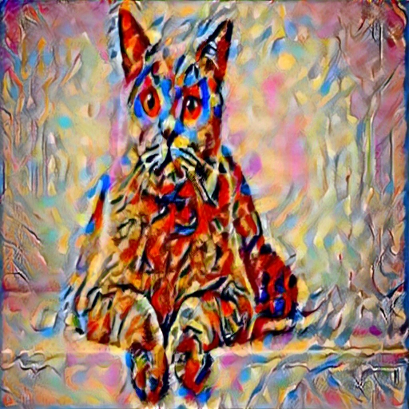
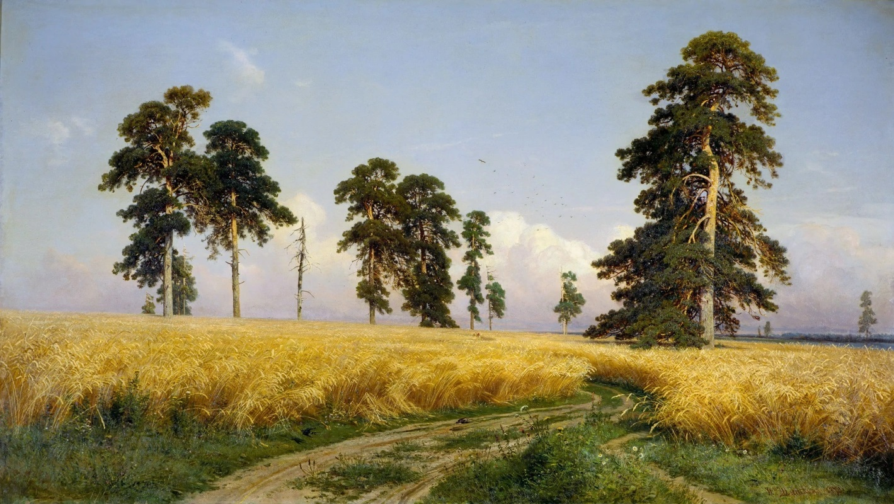

# Neural Style Transfer

Это проект для переноса стиля между изображениями с использованием нейронных сетей и фреймворка Streamlit.

## Описание

Данный проект позволяет загружать контент-изображение и стиль-изображение, а затем выполнять перенос стиля, создавая новое изображение с содержимым контент-изображения и стилем стиль-изображения.

# Примеры работы

## Пример работы веб приложения

<p align="center">
  
</p>
<p align="center">Пример работы веб приложения</p>


### Пример 1

<table>
  <tr>
    <td></td>
    <td></td>
    <td></td>
  </tr>
  <tr>
    <td>Content Image 1</td>
    <td>Style Image 1</td>
    <td>Result Image 1</td>
  </tr>
</table>

### Пример 2

<table>
  <tr>
    <td></td>
    <td></td>
    <td></td>
  </tr>
  <tr>
    <td>Content Image 2</td>
    <td>Style Image 2</td>
    <td>Result Image 2</td>
  </tr>
</table>

### Пример 3

<table>
  <tr>
    <td></td>
    <td></td>
    <td></td>
  </tr>
  <tr>
    <td>Content Image 3</td>
    <td>Style Image 3</td>
    <td>Result Image 3</td>
  </tr>
</table>

### Пример 4

<table>
  <tr>
    <td></td>
    <td></td>
    <td></td>
  </tr>
  <tr>
    <td>Content Image 4</td>
    <td>Style Image 4</td>
    <td>Result Image 4</td>
  </tr>
</table>

### Пример 5

<table>
  <tr>
    <td></td>
    <td></td>
    <td></td>
  </tr>
  <tr>
    <td>Content Image 5</td>
    <td>Style Image 5</td>
    <td>Result Image 5</td>
  </tr>
</table>


## Установка и запуск

### Использование Docker

1. ```docker build -t neural-style-transfer .```
2. ```docker run -p 8501:8501 neural-style-transfer```
3. ```http://localhost:8501```

### Локальная установка

1. ```git clone https://github.com/ozyobr/NeuralStyleTransfer.git```
2. ```cd NeuralStyleTransfer```
3. ```python -m venv .venv```
   ```source .venv/bin/activate  # Для Windows: .venv\Scripts\activate```
4. ```pip install -r requirements.txt```
5. ```streamlit run app.py```
